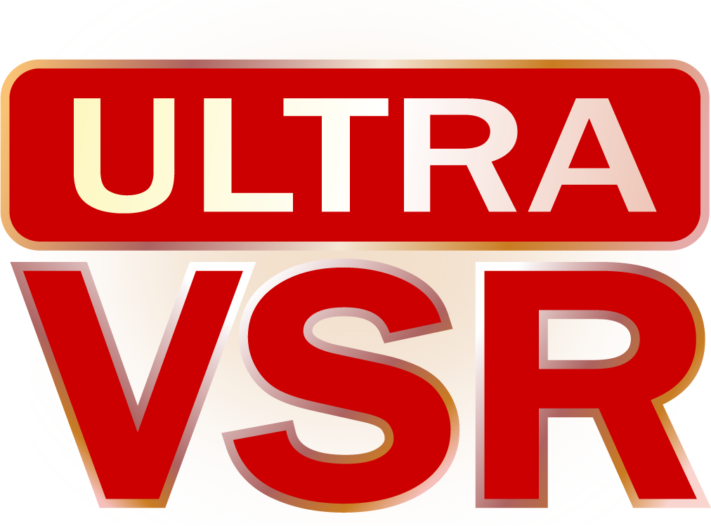

<p align="center">
  
</p>

# UltraVSR: Achieving Ultra-Realistic Video Super-Resolution with Efficient One-Step Diffusion Space (ACMMM 2025)
[Yong Liu](https://scholar.google.com/citations?user=DT0LPIEAAAAJ&hl=en&oi=sra), 
[Jinshan Pan](https://scholar.google.com/citations?hl=zh-TW&user=CMsNjGIAAAAJ), 
[Yinchuan Li](https://scholar.google.com/citations?hl=zh-TW&user=M6YfuCTSaKsC), 
Qingji Dong, 
Chao Zhu, 
[Yu Guo](https://scholar.google.com/citations?hl=zh-TW&user=OemeiSIAAAAJ), 
[Fei Wang](http://www.aiar.xjtu.edu.cn/info/1046/1242.htm)<br/>


 
<a href="https://arxiv.org/abs/2505.19958" target='_blank'></a>
<a href="https://youtu.be/IqH3Y2-4hno" target='_blank'></a>

[](https://github.com/yongliuy/UltraVSR/)


:sparkling_heart: If our DITN is helpful to your researches or projects, please help star this repository. Thanks! :hugs: 

## :tv: Overview

<p align="center">

</p>

>In this paper, we propose UltraVSR, a novel framework that enables ultra-realistic and temporal-coherent VSR through an efficient one-step diffusion space. 
A central component of UltraVSR is the Degradation-aware Restoration Schedule (DRS), which estimates a degradation factor from the low-resolution input and transforms iterative denoising process into a single-step reconstruction from low-resolution to high-resolution videos. 
This design eliminates randomness from diffusion noise and significantly speeds up inference. 
To ensure temporal consistency, we propose a lightweight yet effective Recurrent Temporal Shift (RTS) module, composed of an RTS-convolution unit and an RTS-attention unit.
By partially shifting feature components along the temporal dimension, these two units collaboratively facilitate effective feature propagation, fusion, and alignment across neighboring frames, without relying on explicit temporal layers. 
The RTS module is integrated into a pretrained text-to-image diffusion model and is further enhanced through Spatio-temporal Joint Distillation (SJD), which improves temporal coherence while preserving realistic details. 
Additionally, we introduce a Temporally Asynchronous Inference (TAI) strategy to capture long-range temporal dependencies under limited memory constraints. 
Extensive experiments show that UltraVSR achieves state-of-the-art performance, both qualitatively and quantitatively, in a single sampling step. 


## :link: BibTeX
If you find this project useful for your research, please use the following BibTeX entry.
```
@inproceedings{liu2025ultravsr,
  title={UltraVSR: Achieving Ultra-Realistic Video Super-Resolution with Efficient One-Step Diffusion Space},
  author={Liu, Yong and Pan, Jinshan Pan and Li, Yinchuan and Dong, Qingji and Zhu, Chao and Guo, Yu and Wang, Fei},
  booktitle={Proceedings of the 33st ACM International Conference on Multimedia},
  year={2025}
}
```
